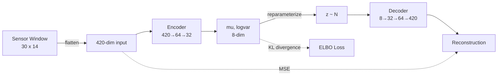

# VAE for Sensor Anomaly Detection on Turbofan Engines

## Motivation

VAE trained only on healthy sensor data, then used reconstruction error to flag degradation in turbofan engines. Compared against Isolation Forest, One-Class SVM, and a standard Autoencoder on the NASA C-MAPSS dataset (run-to-failure simulations with known fault modes).

## Architecture



The VAE is trained on **healthy** engine windows only. At test time, degraded windows produce higher reconstruction error, which acts as the anomaly score.

Baselines operate on the same flattened windows:
- **Isolation Forest**: random partitioning in feature space
- **One-Class SVM**: learned decision boundary around healthy data
- **Standard Autoencoder**: same architecture minus the KL term

## Results

### Anomaly Detection (validation engines, degradation threshold = 50% of RUL cap)

| Model | F1 (FD001) | AP (FD001) | F1 (FD004) | AP (FD004) |
|-------|-----------|-----------|-----------|-----------|
| **VAE** | **0.797** | **0.888** | 0.467 | 0.316 |
| Isolation Forest | 0.858 | 0.933 | 0.465 | 0.322 |
| One-Class SVM | 0.794 | 0.872 | 0.470 | 0.319 |
| Standard AE | 0.605 | 0.707 | 0.461 | 0.329 |

### RUL Prediction (FD001, per-engine last window)

| Model | RMSE (cycles) |
|-------|-------------|
| VAE (latent + recon) | 71.88 |
| Standard AE (recon) | 81.17 |

**Key observations:**
- On FD001 (single operating condition), Isolation Forest is hard to beat. It operates on the raw 420-dim feature space, while the VAE compresses through an 8-dim bottleneck.
- VAE clearly outperforms the standard AE, showing the KL regularization adds value even when it does not reach full utilization.
- FD004 is very hard for all models. Six operating conditions and two fault modes make per-engine normalization insufficient.
- RUL prediction from reconstruction error has limitations. A dedicated supervised model (LSTM, CNN) would do better, but this was not the goal.

## Quick Start

```bash
python -m venv .venv && source .venv/bin/activate
pip install -r requirements.txt
make download && make train
```

## Project Structure

```
├── src/
│   ├── data/          # download, preprocessing, PyTorch dataset
│   ├── models/        # VAE, AE, Isolation Forest, OC-SVM
│   ├── evaluation/    # anomaly scoring, RUL, visualization
│   └── utils/         # config loader
├── configs/           # experiment YAML
├── tests/             # unit tests
├── run_all.py         # full pipeline
├── Makefile
└── requirements.txt
```

## Technical Decisions

**Per-engine normalization** instead of global: each engine has its own operating history and failure trajectory. Global normalization would leak information across engines. The trade-off is that it makes cross-engine RUL regression harder, since the same normalized value means different things for different engines.

**Sliding windows of 30 timesteps**: shorter windows lose temporal context (you need to see a trend to detect degradation). Longer windows waste early healthy data and reduce the number of training samples. 30 was a good balance for average engine life of 150-300 cycles.

**KL annealing with free bits**: without it, the KL term collapses to zero and the VAE degenerates into a regular autoencoder. Free bits (minimum KL of 0.1 per latent dimension) keeps the encoder from ignoring the latent space entirely. beta=0.5 gives the reconstruction term more weight, which is what matters for anomaly detection.

**Reconstruction error as anomaly score**: simpler than density-based approaches in latent space, and it works well in practice. The model is trained to reconstruct healthy patterns, so degraded patterns have higher error.

**Validation split on training engines**: test engines in C-MAPSS are cut off at random points (not run to failure). This makes them poor candidates for anomaly evaluation. Validation engines from the training set run to failure, giving a balanced mix of healthy and degraded windows.

## Limitations and Future Work

- **Isolation Forest beats VAE on FD001**: the single-condition, single-fault subset is simple enough that a non-parametric method on raw features is sufficient. The VAE's compression bottleneck loses information that IF can use.
- **FD004 is unsolved**: all models get F1 around 0.47. Multiple operating conditions make it hard to define "normal" behavior per engine. Operating condition normalization or a conditional VAE could help.
- **RUL prediction is a secondary task here**: the reconstruction-error-to-RUL mapping via gradient boosting is crude. A proper RUL model would use sequence-to-one architectures (LSTM, Transformer) trained end-to-end.
- **No hyperparameter search**: latent dim, hidden sizes, learning rate were set manually. Bayesian optimization could improve results.
- The latent space visualization works but the latent code is mostly at the free-bits floor. A deeper investigation into VAE variants (VQ-VAE, beta schedules) would be worth trying.
